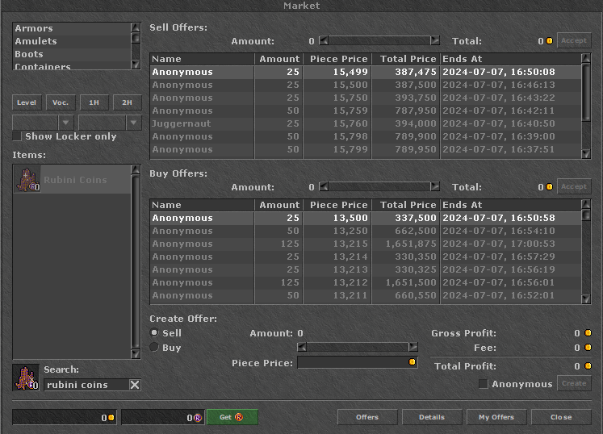
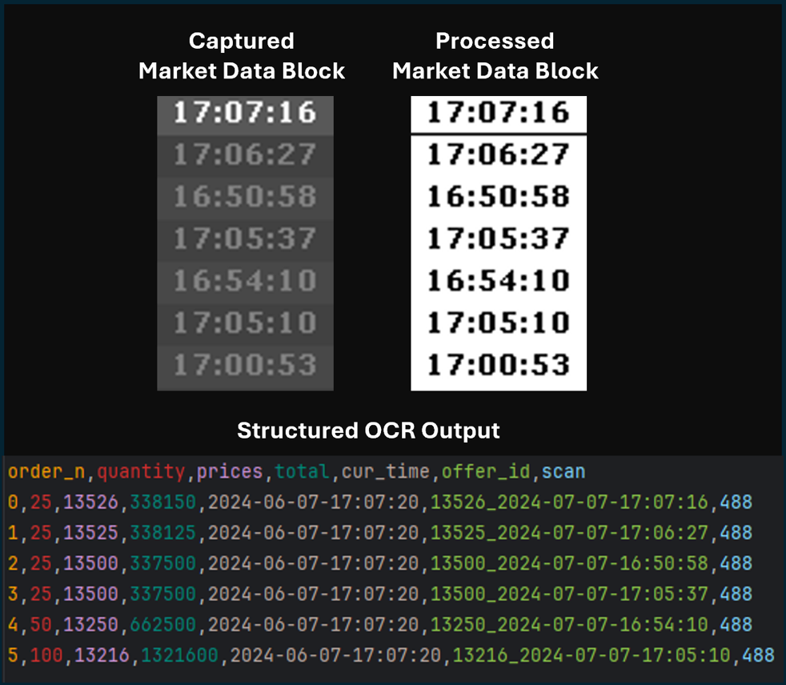

## MMO Market Tracker

*RubinOT Version*

### About

This is a simple but powerful tool to track the movement of assets in games featuring a traditional market interface with bid and ask options using Optical Character Recognition (OCR).

While most modern games have APIs that trivialize tracking this information, programmatic queries are largely missing in older games such as CipSoft's Tibia (which launched in 1997!), requiring less orthodox methods to obtain market information.

Currently, this tool only supports `Windows` platforms.

### OCR Summary

How a typical Tibia "Market" window looks like:

To get the prices for a particular item (in this example, *Rubini Coins*), we take "background" screenshots with `win32ui.CreateBitMap` of blocks of offer data, and get the text by using `pytesseract` after processing.

To interact with the market page in the game, we use `pywin32` PostMessage method to send key and mouse presses in **stealth** mode, that is, without hijacking the keyboard or mouse from the user. 

The ability to take screenshots and input actions without affecting foreground tasks means this tool can be deployed in the background and does not require a dedicated terminal - in contrast to similar market tracking with OCR methods on GitHub.

### Result Analysis and Visualization

From the OCR method with the [`main_collect.py`](MarketTracker/main_collect.py) method, we collect market data every few seconds, store it to a master `pandas` data frame, and run a variety of analyses through the [`main_analyze.py`](MarketTracker/main_analyze.py) method to calculate trade volume, average prices, and more. 

The results are plotted with `plotly`, and saved to a `.html` page for ease of visualization:

As Tibia's rudimentary market UI and lack of API access prevent us from detecting market movements directly, I developed a few routines to infer movements for ask or bid operations. 

These include:
- When an order is at the top of the orders list and disappears on the next scan, it's safe to assume that the offer was filled, thus, a trade is registered at that particular value and volume.
- Orders can be listed with varying quantities, when the quantity for a given offer at scan *n* is reduced by *x* at scan *n+1,* an order of size *x* at that price was fulfilled.

### Known Issues

However, these heuristics are not without faults. 

Although rare, canceled orders at the top of the order list could be incorrectly called fulfilled orders. 

Further, the OCR is not perfect (although its accuracy is north of 99%), and sometimes order timestamps might be misread, leading to duplication of orders.

### Future Development:

For the next version of this tool, I plan to add the following:
- Further optimize the OCR speed and accuracy
- Add more analysis routines for algorithmic trading (pair arbitrage, trend following, automatic detection of order setting mistakes, etc.)
- Streamline the coordinate setting process with a GUI

### Usage in Other Servers

This version of the tool is optimized for tracking the item "Rubini Coins" in the Open Tibia server "Rubinot", but it should work with minimum modifications in any Tibia server that does not use BattleEye.

To use this tool in a BattleEye-equipped server, the [`game_interaction`](helpers/game_interaction) module will need to be reworked to use `pyautogui` for sending inputs and taking screenshots, losing the feature of running in the background.

### Usage in Other Games

Since the [`vision.py`](helpers/game_interaction/vision.py) (OCR) and [`os_interface.py`](helpers/game_interaction/os_interface.py) classes are mostly independent, this tool can be extended to work on other games as well.

If you plan to use MMO Market Tracker for a Tibia server, be sure to edit the contents of the [`cons.py`](configs/cons.py) file to match the **window** coordinates of the buttons to be clicked. More information on how to set up the proper coordinates is described in the file's documentation.

If you plan to use MMO Market Tracker for other games, the contents of *helpers* and *analyze_prices* are easily portable, but other parts of the code will need significant reworks.

### Requirements

This tool was tested with the following packages, although it should work with most other versions of the below.

`Python 3.10`

`numpy 1.26`

`pandas 2.2`

`pillow 10.3`

`plotly 5.22`

`pytesseract 0.3.10`

`pywin32 3.06`

`opencv-python 4.10`

Further, the tesseract binaries should be installed and their path made available in the [`read_market.py`](MarketTracker/core/read_market.py) method, like such:

`pytesseract.pytesseract.tesseract_cmd = r'C:\Program Files\Tesseract-OCR\tesseract.exe'`

